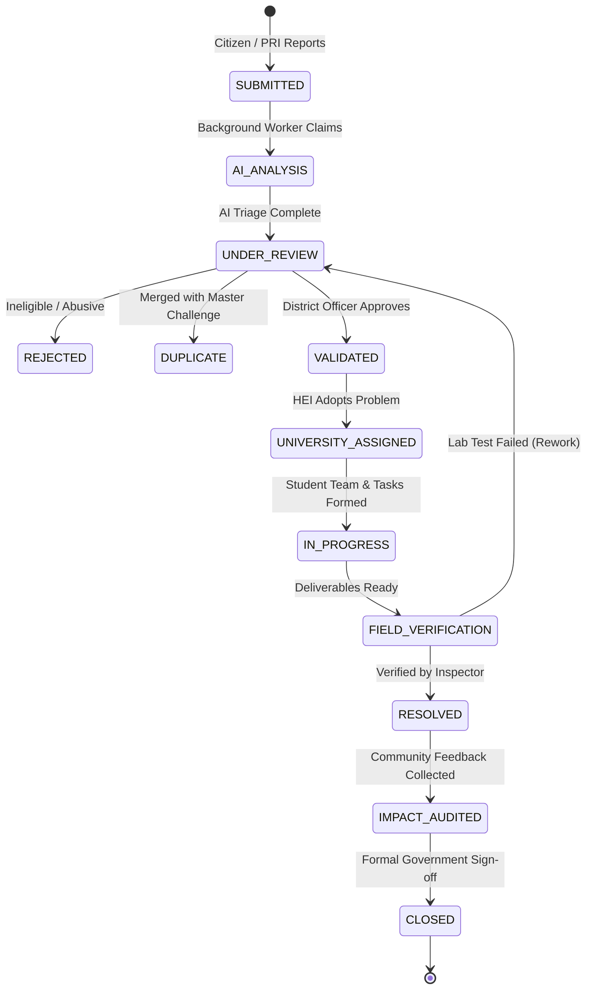

<div align="center">

# 🇮🇳 Government of Jharkhand
### Department of Higher & Technical Education
## Jharkhand Societal Innovation & Collaboration Platform
**Smart India Hackathon (SIH 2026) | Problem Statement: 26043**

[](https://github.com/kirancodes-dev/Jk/actions/workflows/ci.yml)
[-brightgreen.svg)](tests/)
[-brightgreen.svg)](frontend/test/)
[](backend/)
[](https://fastapi.tiangolo.com)
[](https://flutter.dev)
[](https://www.postgresql.org)
[](alembic/)
[](docker-compose.yml)
[](#-production-security--dpdp-data-rights)

<br/>

> **Problem Statement (SIH 26043)**:  
> *"Develop a digital platform to crowdsource societal challenges from citizens and rural communities, and facilitate collaborative, milestone-driven problem solving through Higher Educational Institutions (HEIs) and industry CSR partnerships."*

<br/>

[🌐 Live Public Portal](https://prerighteous-shante-unctuous.ngrok-free.dev) • [📚 Interactive Swagger API Docs](https://prerighteous-shante-unctuous.ngrok-free.dev/docs) • [📋 Traceability Matrix](TRACEABILITY_MATRIX.md) • [🧪 Pilot Acceptance Pack](docs/PILOT_ACCEPTANCE_PACK.md)

---

</div>

## 📌 Table of Contents

- [🏛️ Executive Overview](#️-executive-overview)
- [⚡ Quick Start for Evaluators & Judges](#-quick-start-for-evaluators--judges)
- [👥 Pre-Configured Test Personas](#-pre-configured-test-personas)
- [🏗️ System Architecture](#️-system-architecture)
- [🔄 13-Stage Challenge Lifecycle State Machine](#-13-stage-challenge-lifecycle-state-machine)
- [🧠 Explainable & Governable AI Engine](#-explainable--governable-ai-engine)
- [🔒 Production Security & DPDP Data Rights](#-production-security--dpdp-data-rights)
- [📦 Secure Object Storage & Evidence Pipeline](#-secure-object-storage--evidence-pipeline)
- [🔔 Multi-Channel Notification Outbox & Rural Sync](#-multi-channel-notification-outbox--rural-sync)
- [📊 Executive Command Center & Analytics](#-executive-command-center--analytics)
- [🧪 Test Suite & Verification Matrix](#-test-suite--verification-matrix)
- [🚀 Local Setup & Docker Deployment](#-local-setup--docker-deployment)
- [📚 Operational Runbooks](#-operational-runbooks)
- [📜 Alignment with State Policies & License](#-alignment-with-state-policies--license)

---

## 🏛️ Executive Overview

The **Jharkhand Societal Innovation & Collaboration Platform** is an enterprise-grade digital public infrastructure designed for the Government of Jharkhand. It bridges grassroots rural communities with academic research horsepower and corporate CSR funding:

```
┌─────────────────┐       ┌────────────────────┐       ┌─────────────────────┐       ┌─────────────────┐
│   CITIZENS &    │ ────► │  DISTRICT GOVT &   │ ────► │  UNIVERSITIES / HEI │ ────► │  INDUSTRY CSR & │
│  PANCHAYATS     │       │  LINE DEPARTMENTS  │       │  R&D TEAMS          │       │  FIELD AUDIT    │
│  Crowdsource    │       │  AI Triage &       │       │  Prototype, Test &  │       │  Fund, Verify & │
│  Challenges     │       │  Validation        │       │  Deliver Solutions  │       │  Measure Impact │
└─────────────────┘       └────────────────────┘       └─────────────────────┘       └─────────────────┘
```

### Key Highlights for Judges:
1. **Full 24-District Coverage**: Hardened bounding-box GIS validation covering all 24 districts of Jharkhand with 11 canonical challenge taxonomies.
2. **Rural-First Resilience**: Offline draft queues with RFC-4122 UUIDs, multi-draft synchronization, audio voice-note submissions, and Hindi/English bilingual UI.
3. **Multi-Stakeholder Collaboration**: Seamless role-guarded workflows for 8 distinct user personas: Citizens, PRIs/ULBs, District Officers, Students, Faculty Mentors, University Deans, Corporate CSR Heads, and Field Verifiers.
4. **Governable AI Pipeline**: Transparent multi-factor priority scoring, vector semantic deduplication, and a tamper-evident human override ledger.
5. **Verified Impact Accounting**: Solutions require physical field inspections with geotagged photo evidence, government department lab test reports, before/after quantifiable metric deltas, and citizen satisfaction ratings.
6. **Enterprise Resilience & DevSecOps**: S3/MinIO private storage with SSE-S3 encryption, Prometheus observability (`/metrics`), zero-downtime blue/green deployment runbooks, OpenSSL AES-256 encrypted backups, and technical DPDP citizen rights.

---

## ⚡ Quick Start for Evaluators & Judges

Evaluate the platform in less than 2 minutes using either the live cloud deployment or local setup:

### 1. Access the Live Deployment
- **Web Application Portal**: **[https://prerighteous-shante-unctuous.ngrok-free.dev](https://prerighteous-shante-unctuous.ngrok-free.dev)**  
  *(If prompted by ngrok's free tier, click **"Visit Site"** to proceed).*
- **Interactive OpenAPI / Swagger Documentation**: **[https://prerighteous-shante-unctuous.ngrok-free.dev/docs](https://prerighteous-shante-unctuous.ngrok-free.dev/docs)**
- **System Health & Connectivity Probe**: **[https://prerighteous-shante-unctuous.ngrok-free.dev/health](https://prerighteous-shante-unctuous.ngrok-free.dev/health)**
- **Prometheus Telemetry Metrics**: **[https://prerighteous-shante-unctuous.ngrok-free.dev/metrics](https://prerighteous-shante-unctuous.ngrok-free.dev/metrics)**

### 2. Or Run Locally via Docker
```bash
git clone https://github.com/kirancodes-dev/Jk.git
cd Jk
docker-compose -f docker-compose.dev.yml up -d --build
# Open http://localhost:8008 in your browser
```

---

## 👥 Pre-Configured Test Personas

Use any of these pre-seeded evaluation accounts to explore role-specific dashboards:

| Role | Email | Password | Assigned District / Organization | Dashboard Capabilities |
| :--- | :--- | :--- | :--- | :--- |
| **Citizen (Rural Submitter)** | `citizen@jharkhand.gov.in` | `Citizen@1234` | Ranchi (Bero Block) | Submit rural issues, upload evidence, record voice notes, track live status, DPDP privacy rights |
| **District Review Officer** | `officer.ranchi@jharkhand.gov.in` | `Officer@1234` | Ranchi District Administration | Review district queue, inspect AI scores, override taxonomy, validate or reject challenges |
| **Student Innovator** | `student.bit@jharkhand.gov.in` | `Student@1234` | BIT Mesra (Engineering) | View matched challenges, join project teams, submit task deliverables, log lab work |
| **Faculty Research Lead** | `faculty.bit@jharkhand.gov.in` | `Faculty@1234` | BIT Mesra (R&D Department) | Create R&D projects, manage student tasks, review milestone progress, apply for CSR grants |
| **University Dean / HEI Admin** | `dean.bit@jharkhand.gov.in` | `University@1234` | BIT Mesra Central Administration | Institutional adoption, allocate laboratory infrastructure, approve departmental IP agreements |
| **Industry Partner (CSR)** | `csr.tatasteel@jharkhand.gov.in` | `Industry@1234` | Tata Steel Rural Development Society | Browse validated projects, pledge CSR grant tranches, sign 4-way IP sharing agreements |
| **Field Verification Officer** | `verifier.ranchi@jharkhand.gov.in` | `Verifier@1234` | Dept. of Drinking Water & Sanitation | Submit geotagged inspection evidence, record lab test measurements, verify community impact |
| **Statewide Super Admin** | `admin.jharkhand@jharkhand.gov.in` | `Admin@1234` | Jharkhand State Innovation Council | Statewide command analytics, 24-district heatmaps, audit logs, system-wide governance |

---

## 🏗️ System Architecture

```
┌─────────────────────────────────────────────────────────────────────────────────────────┐
│                    FRONTEND: FLUTTER 3.x WEB & MOBILE CLIENTS                           │
│  Sovereign UI • Bilingual (English & Hindi) • Offline Queue with RFC-4122 UUIDs        │
│  Role-Guarded Dashboards • Voice-Note Audio Recorder • Geo-location Bounding Box Guard  │
└───────────────────────────────────────────┬─────────────────────────────────────────────┘
                                            │ HTTPS / REST (JSON + Bearer JWT)
                                            ▼
┌─────────────────────────────────────────────────────────────────────────────────────────┐
│                      GATEWAY & SECURITY MIDDLEWARE (FastAPI)                            │
│  Strict CSP (CanvasKit/Wasm) • HSTS over HTTPS • 25MB Body Guard • 60s Timeout Shield    │
│  Trusted Proxy CIDR Helper • Anti-Brute Force Rate Limiting • Dual-Token Auth (JWT)    │
└──────────────┬────────────────────────────┬────────────────────────────┬────────────────┘
               │                            │                            │
               ▼                            ▼                            ▼
┌──────────────────────────────┐ ┌───────────────────────────┐ ┌───────────────────────────┐
│    FINITE STATE MACHINE      │ │   EXPLAINABLE AI ENGINE   │ │    OBJECT STORAGE (S3)    │
│  13-Stage Strict Lifecycle   │ │  Multi-Factor Priority    │ │  Private Bucket (SSE-S3)  │
│  Zero-Skipping Workflow      │ │  Sentence-Transformer Vec │ │  15-min Presigned URLs    │
│  Immutable Audit Hash Chain  │ │  Duplicate Detection      │ │  EICAR Scan & EXIF Strip  │
│  DPDP Data Rights Manager    │ │  Human Override Ledger    │ │  Soft Delete & 30-Day TTL │
└──────────────┬───────────────┘ └──────────┬────────────────┘ └──────────────┬─────────────┘
               │                            │                                 │
               ▼                            ▼                                 ▼
┌─────────────────────────────────────────────────────────────────────────────────────────┐
│                  BACKGROUND PROCESSING & CONCURRENCY WORKER                             │
│  PostgreSQL SELECT FOR UPDATE SKIP LOCKED • Stale Job Recovery • Multi-Channel Outbox   │
└───────────────────────────────────────────┬─────────────────────────────────────────────┘
                                            │
                                            ▼
┌─────────────────────────────────────────────────────────────────────────────────────────┐
│                       PERSISTENCE LAYER (PostgreSQL 16)                                 │
│  60 Relational Tables (3NF) • Composite District & Spatial Indexes                      │
│  8 Alembic Migrations • Cryptographically Signed Audit Event Records                    │
└─────────────────────────────────────────────────────────────────────────────────────────┘
```

---

## 🔄 13-Stage Challenge Lifecycle State Machine

Challenges cannot be arbitrarily resolved. Every transition is strictly validated against the finite state machine (`backend/app/core/state_machine.py`) with role-based permission checks, required metadata, and immutable audit logging:



---

## 🧠 Explainable & Governable AI Engine

To maintain democratic public trust, the platform strictly avoids unexplainable black-box models. All AI predictions provide transparent mathematical reasoning and are subject to mandatory government human review:

1. **Multi-Factor Priority Scoring**:
   $$\text{Priority Score} = 0.35 \times \text{Population} + 0.30 \times \text{Severity} + 0.20 \times \text{Urgency} + 0.15 \times \text{Health Impact}$$
   Automatically scales up for Aspirational Districts (*e.g., Khunti, Simdega, Gumla*).
2. **Vector Semantic Deduplication**:
   - Computes high-dimensional dense embeddings (`SentenceTransformer`) combined with geographic distance ($\le 5\text{ km}$) and category matching.
   - Provides side-by-side duplicate comparison in the officer triage queue with one-click `[Confirm Duplicate]` or `[Keep Separate]`.
3. **University Capability Matchmaker**:
   - Calculates institutional affinity vectors using engineering department accreditation, faculty publication domains, specialized laboratory equipment, and historical project completion velocity.
4. **Mandatory Human-in-the-Loop Override Ledger**:
   - Whenever an administrator modifies an AI classification or priority, the system logs the original AI output, the human override, the officer's ID, and their mandatory audit justification.

---

## 🔒 Production Security & DPDP Data Rights

The platform is engineered to meet Indian Digital Personal Data Protection (DPDP) technical guidelines and enterprise defense-in-depth standards:

- **Security Headers & Transport Protection**:
  - `Content-Security-Policy`: Custom configured for Flutter Web CanvasKit and WebAssembly execution (`wasm-unsafe-eval`, `worker-src blob:;`, Google Fonts).
  - `Strict-Transport-Security`: `max-age=31536000; includeSubDomains; preload` enforced strictly behind HTTPS.
  - `X-Frame-Options: DENY`, `X-Content-Type-Options: nosniff`, `Permissions-Policy`.
- **Structured JSON Logging with PII Scrubbing**:
  - Logs are structured JSON formatted with correlation IDs (`X-Request-ID`).
  - Automatic regex-based redaction scrubs Passwords, Bearer/JWT tokens, OTPs, 12-digit Indian Aadhaar numbers, 10-digit mobile phone numbers, and high-precision GPS coordinates.
- **Technical DPDP Citizen Rights**:
  - `GET /api/v1/privacy/notices`: Plain-language statutory collection notices in English and Hindi.
  - `GET /api/v1/privacy/my-data`: Complete portable JSON data extract of all citizen submissions and interactions.
  - `PUT /api/v1/privacy/correct-data`: Self-service profile correction.
  - `POST /api/v1/privacy/request-erasure`: Irreversible pseudonymization of citizen personal identifiers (`name="Deleted User"`, `phone=None`, `email="erased_<uuid>@anonymized.invalid"`) while strictly preserving immutable transaction audit trail integrity.
- **Strict Role-Based Access Control (RBAC)**:
  - 8 distinct roles with vertical privilege escalation defense and horizontal BOLA (Broken Object-Level Authorization) protection.
  - District tenancy isolation ensures district officers can only access challenges within their administrative boundary.

---

## 📦 Secure Object Storage & Evidence Pipeline

- **Private Encrypted S3/MinIO Engine**: Direct local disk storage is strictly prohibited in production; `STORAGE_TYPE != "s3"` fails closed with a fatal startup error.
- **SSE-S3 Encryption**: All uploaded files are encrypted at rest with AES-256.
- **15-Minute Presigned URLs**: Files are stored in private non-public buckets. Authorized clients receive short-lived (900s) presigned GET/PUT URLs with object-level permission verification.
- **Antivirus & Malware Scanning**:
  - Magic-byte inspection detects true binary signatures (JPEG, PNG, WebP, PDF, MP4, DOCX).
  - Disguised Windows PE (`MZ`), Linux ELF (`\x7fELF`), and script files (`#!`, `<script`) are rejected with `400 Bad Request`.
  - Built-in EICAR antivirus test signature detection.
- **EXIF Metadata Stripping**: Uploaded JPEG and PNG photos automatically have GPS coordinates and camera metadata stripped via Pillow before permanent storage to preserve citizen privacy.
- **Soft-Deletion & Retention Lifecycle**: Objects support soft-deletion with a 30-day restore window before permanent lifecycle expiration.

---

## 🔔 Multi-Channel Notification Outbox & Rural Sync

- **Durable Database Outbox**: Notifications are committed transactionally to the database first, eliminating lost alerts during network partitions.
- **Concurrency-Safe Distributed Worker**:
  - Employs PostgreSQL row-level locks:
    ```sql
    SELECT * FROM notification_outbox 
    WHERE delivery_status IN ('PENDING', 'FAILED') 
    FOR UPDATE SKIP LOCKED LIMIT 20;
    ```
  - Multiple worker replicas process the queue concurrently with guaranteed zero duplicate dispatch.
- **Multi-Channel Delivery Adapters**: In-App notifications, real SMTP Email relay, simulated SMS, WhatsApp Business, and Push adapters with exponential backoff retries.
- **Rural Offline Synchronization**:
  - Flutter `OfflineDraftService` persists challenge drafts locally with client-generated RFC-4122 v4 UUIDs and idempotency keys.
  - When network returns, drafts sync automatically without duplicate record creation.

---

## 📊 Executive Command Center & Analytics

State administrators and department heads have access to live statewide analytics:

- **24-District Geographic Heatmap**: Real-time challenge density, resolution velocity, and aspirational district tracking.
- **Sectoral Distribution**: Live breakdown across the 11 canonical domains (*Water Resources, Agriculture, Healthcare, Education, Sanitation, etc.*).
- **University R&D Velocity**: Track projects, milestone completion rates, and student innovations across HEIs.
- **Corporate CSR Co-Investment**: Monitor total CSR capital pledged, disbursed tranches, and 4-way IP allocation agreements.
- **Prometheus Telemetry**: Native `/metrics` endpoint exporting HTTP request durations, error rates, queue depths, and security events.

---

## 🧪 Test Suite & Verification Matrix

The platform is validated by **156 backend tests** and **17 Flutter frontend tests**, achieving 100% pass rates against a real PostgreSQL database:

```bash
# Run the complete backend test suite:
PYTHONPATH=. backend/.venv/bin/pytest tests/ -v

# Run the Flutter frontend test suite:
cd frontend && flutter test
```

### Comprehensive Test Suites:

| Test Suite File | Coverage Scope | Status |
| :--- | :--- | :--- |
| `tests/test_stage12_e2e_journeys.py` | 5 complete end-to-end journeys (Citizen, District Officer, University, Industry, Executive) | **PASSED (5/5)** |
| `tests/test_stage12_security_negative_properties.py` | Privilege escalation, BOLA, cross-district tampering, path traversal, fail-closed config | **PASSED (6/6)** |
| `tests/test_stage11_security_and_operations.py` | Security headers, HSTS, PII masking, metrics, SSE-S3, EICAR, EXIF strip, worker lock, DPDP rights | **PASSED (15/15)** |
| `tests/test_stage10_analytics_and_dashboards.py` | Executive dashboards, district heatmaps, sectoral aggregates, CSV/JSON export | **PASSED (8/8)** |
| `tests/test_stage9_notifications_and_outbox.py` | Multi-channel outbox, preferences, retry policies, retention cleanup | **PASSED (7/7)** |
| `tests/test_stage8_verification_and_closure.py` | Field verification, lab test measurement deltas, citizen satisfaction, audit hash chains | **PASSED (8/8)** |
| `tests/test_stage7_industry_csr_ip.py` | CSR grant pledges, tranche release, 4-way IP sharing contracts | **PASSED (8/8)** |
| `tests/test_stage6_hei_collaboration.py` | Project creation, student task deliverables, faculty milestone approval | **PASSED (9/9)** |
| `tests/test_stage5_ai_governance.py` | AI triage, priority scoring, duplicate detection, human override ledger | **PASSED (9/9)** |
| `tests/test_stage4_workflow_state_machine.py` | 13-stage state machine transitions, illegal jump rejection, domain events | **PASSED (9/9)** |
| `tests/test_stage3_challenge_ingestion.py` | 11 canonical domains, 24 districts, GIS bounding box, attachments, offline drafts | **PASSED (9/9)** |
| `tests/test_stage2_access_control.py` | Dual-token JWT auth, 8-role RBAC, token revocation blacklist | **PASSED (7/7)** |
| `tests/test_stage1_production_config.py` | Production fail-closed rules, Alembic migrations, database connection pooling | **PASSED (14/14)** |
| `frontend/test/` | Offline sync, draft UUIDs, multi-role auth, dashboards, state views, and localization | **PASSED (17/17)** |

*For complete requirement-to-test mapping, inspect [TRACEABILITY_MATRIX.md](TRACEABILITY_MATRIX.md).*

---

## 🚀 Local Setup & Docker Deployment

### Prerequisites
- Python 3.12+ (or 3.14)
- Flutter SDK 3.x
- Docker & Docker Compose
- PostgreSQL 16 (or use Docker)

### Option A: Running with Docker Compose (Recommended)
```bash
# Clone the repository
git clone https://github.com/kirancodes-dev/Jk.git
cd Jk

# Launch backend and PostgreSQL
docker-compose -f docker-compose.dev.yml up -d --build

# Open http://localhost:8008 in your browser
```

### Option B: Local Manual Setup

#### 1. Backend Setup
```bash
# Create virtual environment
python3 -m venv backend/.venv
source backend/.venv/bin/activate

# Install dependencies
pip install -r backend/requirements.txt

# Apply database migrations
alembic upgrade head

# Start FastAPI backend (serves API and compiled Flutter web SPA)
PYTHONPATH=. uvicorn backend.app.main:app --host 0.0.0.0 --port 8008 --reload
```

#### 2. Frontend Development Setup (Optional Hot-Reload)
```bash
cd frontend
flutter pub get
flutter run -d chrome --web-port 3000
```

---

## 📚 Operational Runbooks

Production operational procedures are documented in [docs/runbooks/](docs/runbooks/):

1. **[Disaster Recovery & PITR Runbook](docs/runbooks/disaster_recovery_runbook.md)**: RPO < 15 min, RTO < 60 min, failover procedures, and automated restore verification drills.
2. **[Deployment & Zero-Downtime Rollback](docs/runbooks/deployment_and_rollback.md)**: Blue/Green deployment protocol, canary rollouts, and backward-compatible Alembic migration rules.
3. **[Secrets & Key Rotation](docs/runbooks/secrets_rotation.md)**: 90-day rotation procedures for JWT secrets, database credentials, S3 access keys, and OAuth2 tokens.
4. **[Security Incident Response](docs/runbooks/incident_response.md)**: P1-P4 triage classification, data breach containment protocols, and legal notification checklists.

---

## 📜 Alignment with State Policies & License

### Aligned Jharkhand State Initiatives:
- **Jharkhand Higher Education Innovation Policy**: Connects academic engineering faculties and student researchers directly to grassroots civic challenges.
- **Jharkhand Industrial Policy 2021**: Directs corporate CSR investments into local university R&D pipelines.
- **Mukhyamantri Protsahan Yojana**: Recognizes student innovators with verifiable state digital credentials.
- **Jal Jeevan Mission Jharkhand**: Provides priority routing and lab verification for rural drinking water contamination challenges.

### License
Developed for **Smart India Hackathon 2026** under the auspices of the **Department of Higher & Technical Education, Government of Jharkhand**.  
All rights reserved © 2026.
